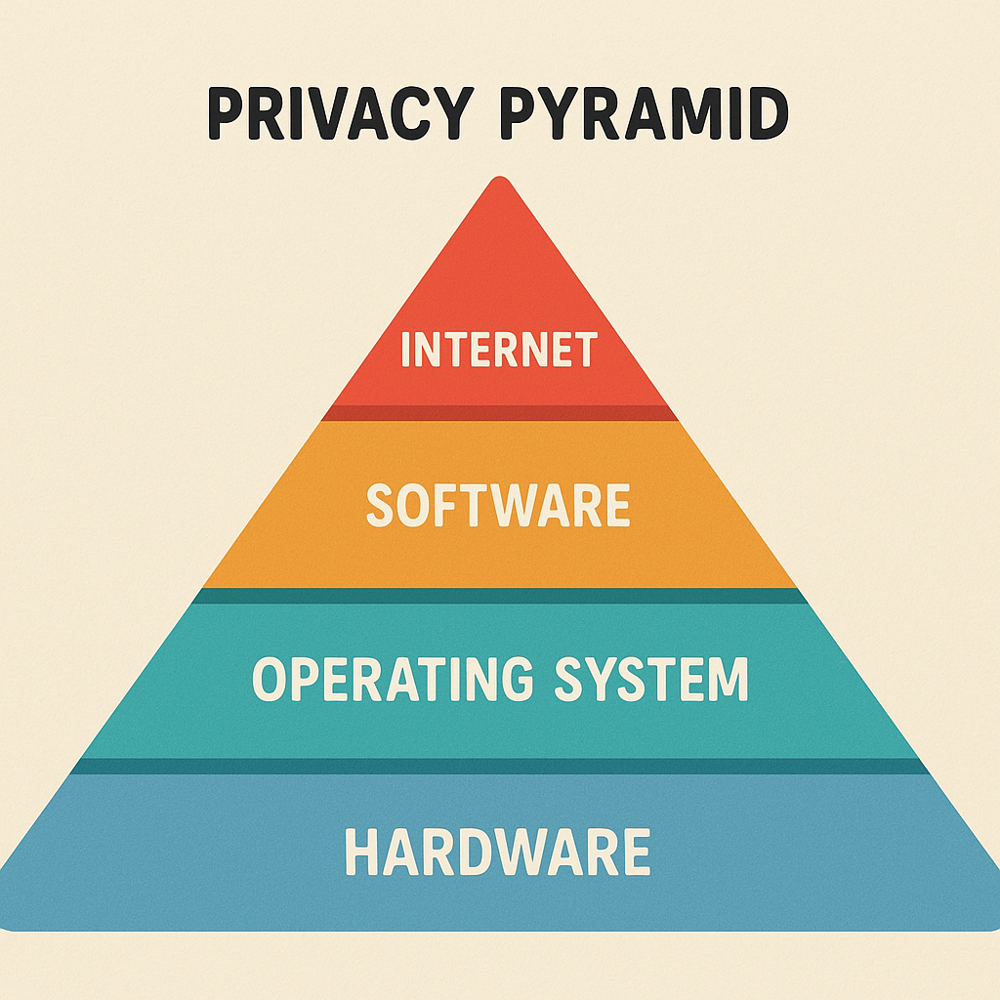

## About GoingDarker

This is an open project to protect Human Right to privacy. Building tools to increase privacy, prevent metadata leakage and bypass the new censorship and citizen control bills like #ChatControl, #ProtectEU, #KOSA, "Age verifications" and so on.

GoingDarker will focus on the personal privacy space:

We will focus on the Operating System + Software + Internet side.

## List of projects

### GoingDarker infraestructure
We need to set up or use a collaborative infraestructure that cannot be taken down. We cannot rely only on GitHub.

### Making Linux private by default
People think Linux is the most private OS, that's not true, let's change that.

### More to come
Wanna propose a new project? Join us.

## Contact

MAIL: cypherbits2@protonmail.com
MATRIX: @goingdarker:matrix.org
More soon.

